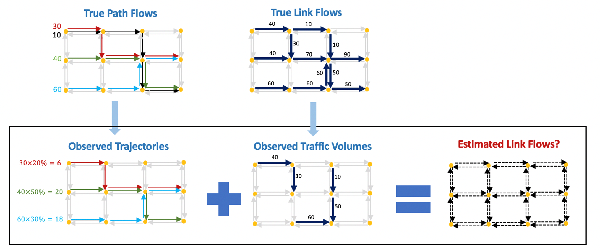
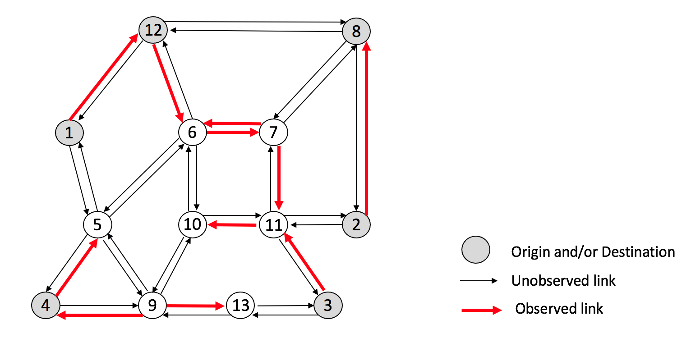

# Inverse-Reinforcement-Learning-for-link-Flow-estimation-IRL-F-
# Background
This repository includes source codes for Inverse Reinforcement Learning for link Flow estimation (IRL-F), which is proposed to estimate link flows on a road network by combining traffic volume data and vehicle trajectory data.

IRL-F can be evaluated in the Nguyen-Dupuis network. There are 13 nodes, 38 links and 18 OD pairs. Given OD flow data, traffic assignment problem has been solved to obtain path flows and link flows, based on which the observed traffic volume data and trajectory data are generated.

# Input data for IRL-F includes:
•	Network property files, which indicate the number of states, the number of actions, and the dimension of the first state feature vector.

•	Transition information, which indicates the actions that the agent needs to take to transition for one state to another state. 

•	State feature files, which include the feature vector of each state in the road network MDP. 

•	Traffic volume data input, which includes the observed traffic volume data.

•	Trajectory data input, which includes the observed trajectory data, and the scaled-up trajectory data that can later be aggregated to provide an estimated population flow number. 

# How to apply IRL-F
Set input data paths and parameters in arg.py. 

Run IRL-F in main.py

Output of IRL-F is a csv file including the final estimated state visitation frequencies. These frequencies can be used to estimate unobserved link flows following simple procedures.

